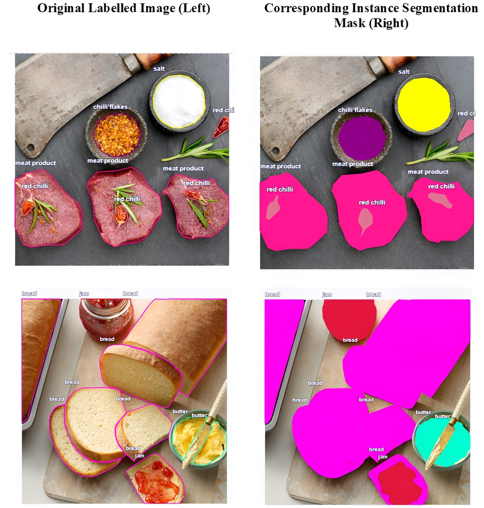
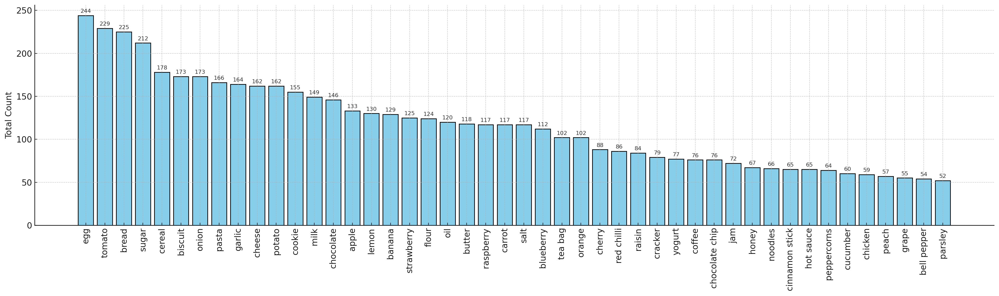

# The Staple Pantry Dataset 🥫

This research introduces the **Staple Pantry Dataset**, a new benchmark for **instance-level ingredient segmentation of raw pantry items** focusing on cluttered and overlapping ingredients. Our dataset offers precise instance masks for everyday food items such as grains, flour, spices, and fresh vegetables, providing a more practical benchmark for real-world kitchen automation systems.

## Dataset Overview 📊
### Key Features
- **1,000 images** with **6,882 instance masks** and **405,534,586 labelled pixels** across **100 ingredient categories**.
- **Real-world complexity**: Overlapping items, obscured items, variable lighting, cluttered backgrounds.
- **High-quality annotations**: Pixel-level polygon masks for fine-grained textures (e.g., salt grains, vegetable stems).

#### Example of an annotated image and a segmentation mask


## Dataset Structure 📂
The dataset is organized as follows:
```plaintext
staple_pantry_1000/
├── images/ # Images Folder (1000 images)
├── annotations/
│ ├── staple_pantry_1000.json # COCO-format annotations
```
## Dataset Statistics 📈
### Class Distribution
**Top 46 ingredient categories by instance count**
  

## Dataset Splits 🧩
| Split | Images | Instances |  
|-------|--------|-----------|  
| Train | 800    | 5,506     |  
| Test  | 200    | 1,376     | 

